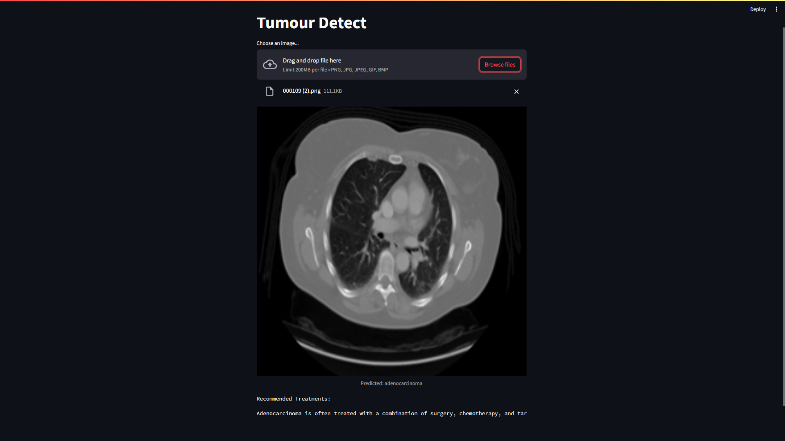

# Tumor-Detect

## Instructions

1. Run the following command to install dependencies:
    ```bash
    pip install -r requirements.txt
    ```

2. Change paths to the dataset and model data as needed.

3. Run the application using the following command:
    ```bash
    streamlit run app.py
    ```

## Information

This is a simple web application built with Streamlit. It enables users to upload their own data for prediction or use pre-loaded sample data. The model data is saved in TensorFlow format.

**Dataset Link:** [Chest CT Scan Images](https://www.kaggle.com/datasets/mohamedhanyyy/chest-ctscan-images) (with modifications in data control cells)

## Screenshots




